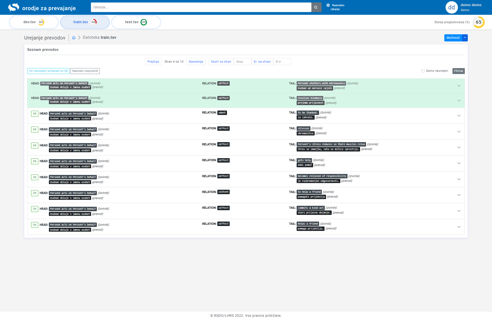
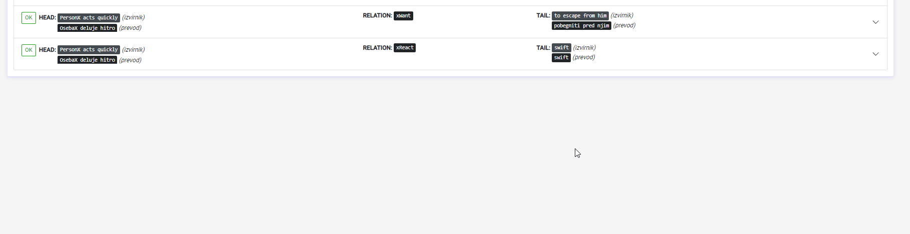

# Navodila za uporabo
Orodje se uporablja za pregled strojno prevedenih besedil. 
Pregledujemo prevod glave (angl. head) in repa (angl. tail). 
Pri prevodu repa je treba upoštevati relacijo (po navadi posledico) in glavo (situacijo).
  
Na glavnem pogledu imamo zgoraj iskalnik, če bi želeli kakšno določeno ključno besedo poiskati. 
V sami sredini strani imamo seznam prevodov, ki jih preverimo, če so ustrezni ali ne. 
**Nasvet:** Glede na to, da se glave večinoma ponavljajo, __najprej preglejte repe.__ 
Nato pa z množičnim urejevalnikom uredite glavo, če je ta tuti narobe. (primeri uporabe sledi nekje spodaj) 
 

## Urejanje prevodov
- V primeru, da je prevod popolnoma ustrezen, pritisnemo na gumb OK 
  
- Če je treba urediti rep prevoda, tega uredimo z razširitvijo elementa in uredbo besedila
  
- V primeru, ko je treba urediti glavo, da ne urejamo vsake posebej, si lahko poslužimo ali z naprednim urejevalnikom
   ali pa s pritiskom na element s: 
  **- sredinskim miškinim gumbom** ...ali 
  **- SHIFT + levi miškin klik** ...ali 
  **- CTRL + levi miškin klik** 
  (ponovno izpostavljam: najprej preglejte repe, nato s to funkcionalnostjo uredite glave)
  
  lahko tudi uporabimo _(Napredni urejevalnik, ki uredi le vidne elemente, (**klik s sredinskim gumbom pa uredi vse**))_ 
  
- Če nismo prepričani glede prevoda in nočemo zapravljati časa na njem predolgo, ga lahko začasno označimo z gumbom `skip`
  

## Ko pregledamo vse prevode
Ko končamo pregled vseh prevodov, lahko zaprosimo administratorja za dodelitev več prevodov, če je teh še kaj ostalo. 

 Po potrebi lahko tudi izvozimo dodeljene prevode v datoteko .tsv
 
